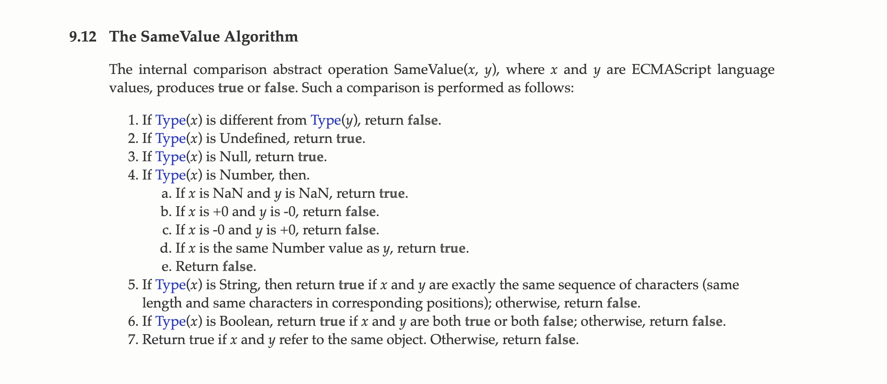
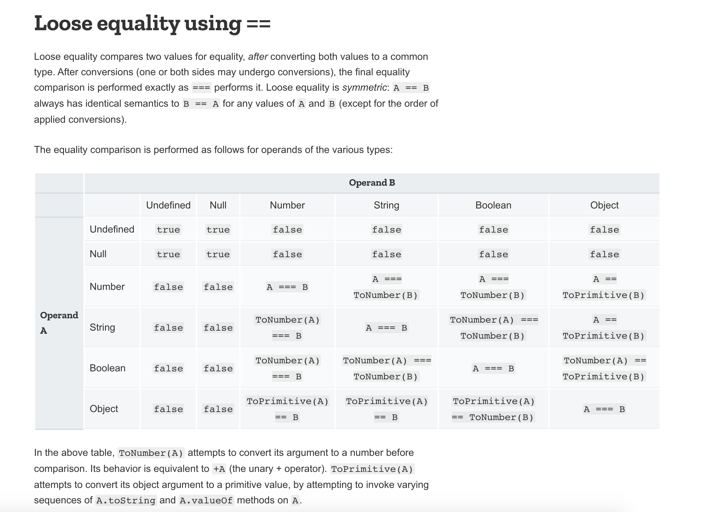

## Equality


JavaScript provides three different value-comparison operations:
* **==** Abstract Equality Comparison ("loose equality", "double equals")
* **===** Strict Equality Comparison ("strict equality", "identity", "triple equals")
* **Object.is** provides SameValue (new in ES2015).

---

### Data types

|         |          |
| ------------- |-------------|
| Primitive     | number, string, boolean, undefined, null, bigInt, symbol |
| Non-primitive | object, arrray, function |

---

### Coercion
Process of converting value from one type to another

#### String

> Explicit string conversion

|         |          |
| ------------- |-------------|
| String("hello")  | "hello"   |
| String(null)  | "null"      |
| String(undefined)  | "undefined"   |
| String(true)  | "true"     |
| String(false)  | "false"   |
| String(12.345)  | "12.345"  |
| String(0)  | "0"      |
| String(-0)  | "0"         |
| String(Infinity)  | "Infinity" |
| String(-Infinity)  | "-Infinity"  |


> Implicit string conversion

|         |          |
| ------------- |-------------|
| "" + "hello"  | "hello"   |
| "" + null  | "null"      |
| "" + undefined  | "undefined"   |
| "" + true  | "true"     |
| "" + false  | "false"   |
| "" + 12.34  | "12.34"  |
| "" + 0  | "0"      |
| "" + -0  | "0"         |
| "" + Infinity  | "Infinity" |
| "" + -Infinity  | "-Infinity"  |


#### Number

> Explicit number conversion

|         |          |
| ------------- |-------------|
| Number(1234)  | 1234   |
| Number(null)  | 0   |
| Number(undefined)  | NaN   |
| Number(true)  | 1   |
| Number(false)  | 0   |
| Number(12.34)  | 12.34   |
| Number("hello")  | NaN   |
| Number("0")  | 0   |
| Number(-0)  | -0   |
| Number(Infinity)  | Infinity   |
| Number(-Infinity)  | -Infinity   |


> Implicit number conversion

|         |          |
| ------------- |-------------|
| +1234  | 1234   |
| +null  | 0   |
| +undefined  | NaN   |
| +true  | 1   |
| +false  | 0   |
| +12.34  | 12.34   |
| +"hello"  | NaN   |
| +"0"  | 0   |
| +(-0)  | -0   |
| +Infinity  | Infinity   |
| +(-Infinity)  | -Infinity   |


#### Boolean

**Falsy values** -  "", null, undefined, 0, -0, false, NaN

> Explicit boolean conversion

|         |          |
| ------------- |-------------|
| Boolean("")  | false   |
| Boolean(null)  | false   |
| Boolean(undefined)  | false   |
| Boolean(0)  | false   |
| Boolean(-0)  | false   |
| Boolean(false)  | false   |
| Boolean(NaN)  | false   |

Apart from falsy values, rest everything is true

|         |          |
| ------------- |-------------|
| Boolean(Infinity)  | true   |
| Boolean(function(){})  | true   |
| Boolean([0])  | true   |
| Boolean({})  | true   |


> Implicit boolean conversion

**First way:**

```
if(booleanValue){
    console.log('Truthy');
}else{
    console.log('Falsy');
}
```


**Second way:**

**!** - it will give true for all falsy value

```
!undefined  // true
!NaN        // true
!-0         // true
```


---

### NaN (Not a number or invalid number)

```
console.log(NaN);
console.log(NaN + 1);
console.log("ten" - 5);
console.log("sunny"/"bar");
console.log(undefined + 1);
```

```
console.log(NaN == NaN);
console.log(NaN == null);
console.log(NaN == 0);
console.log(NaN == undefined);
```

**isNaN** converts the argument to a Number and returns true if the resulting value is NaN.

```
console.log(isNaN(NaN));
console.log(isNaN("hello"));
console.log(isNaN(undefined + 1));

console.log(isNaN("5"));
console.log(isNaN(12));
console.log(isNaN(10/0));
```


**Number.isNaN** does not convert the argument; it returns true when the argument is a Number and is NaN.


```
console.log(Number.isNaN(NaN));
console.log(Number.isNaN("hello"));
console.log(Number.isNaN(undefined + 1));

console.log(Number.isNaN("5"));
console.log(Number.isNaN(12));
console.log(Number.isNaN(10/0));
```

```
console.log(Number.isNaN(Number("hello")));
console.log(Number.isNaN("foo"/"bar"));
```

```
console.log("b" + "a" + +"a" + "a");
```

---

### Object.is

The Object.is() method determines whether two values are the same value.

```
console.log(NaN == NaN);

console.log(0 == -0);
console.log(true == 1);
console.log(5 == "5");
console.log(undefined == null);

console.log(0 === -0);
```

```
console.log(Object.is(NaN, NaN));

console.log(Object.is(0, -0));
console.log(Object.is(true, 1));
console.log(Object.is(5, "5"));
console.log(Object.is(undefined, null));
```



---


### Equality Comparison chart


